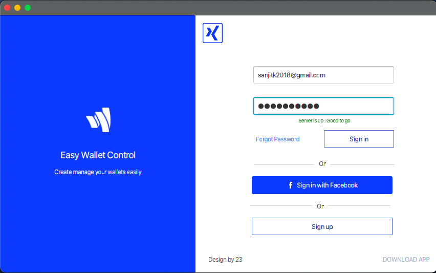
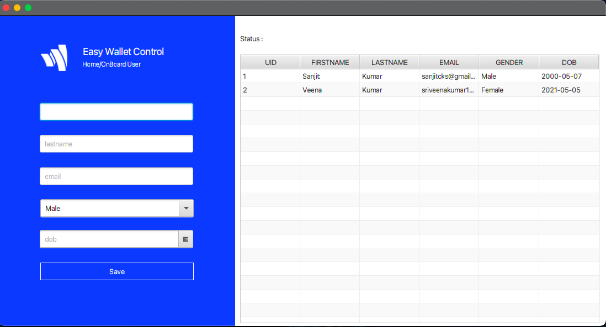

# MySQL - JDBC - JavaFX - Simple Login/Data Addition and Retrieval

## How to run?

- Clone the Repo
- Install the JavaFX SDK from [here](https://gluonhq.com/products/javafx/)
- Add VM Path
- Also install the JDBC MySQL Connector from [here](https://dev.mysql.com/downloads/connector/j/)
- Unzip and save the extracted directory in your local drive (lib dir inside this)
- In Intellij Idea: open the repo, go to project preferences and add the lib directory as a library
- Also add the mysql jdbc connector jar file

### Create Database/Tables

- Add the following two tables: admins and wip_users
- admins table: id, email, password
- wip_users table: uid, firstname, lastname, email, gender, dob
  
Compile and Run the Program.

## UI

